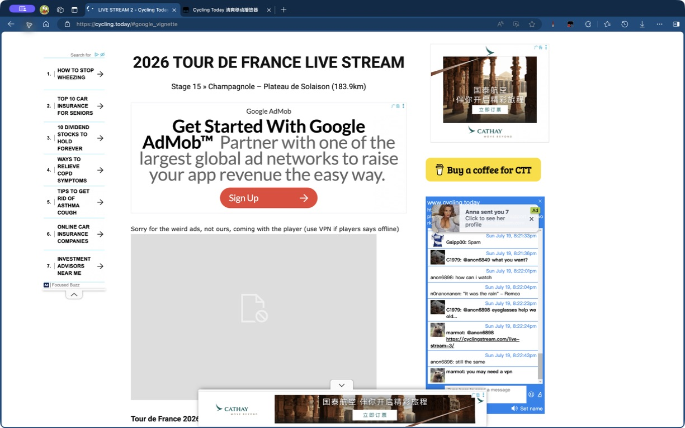
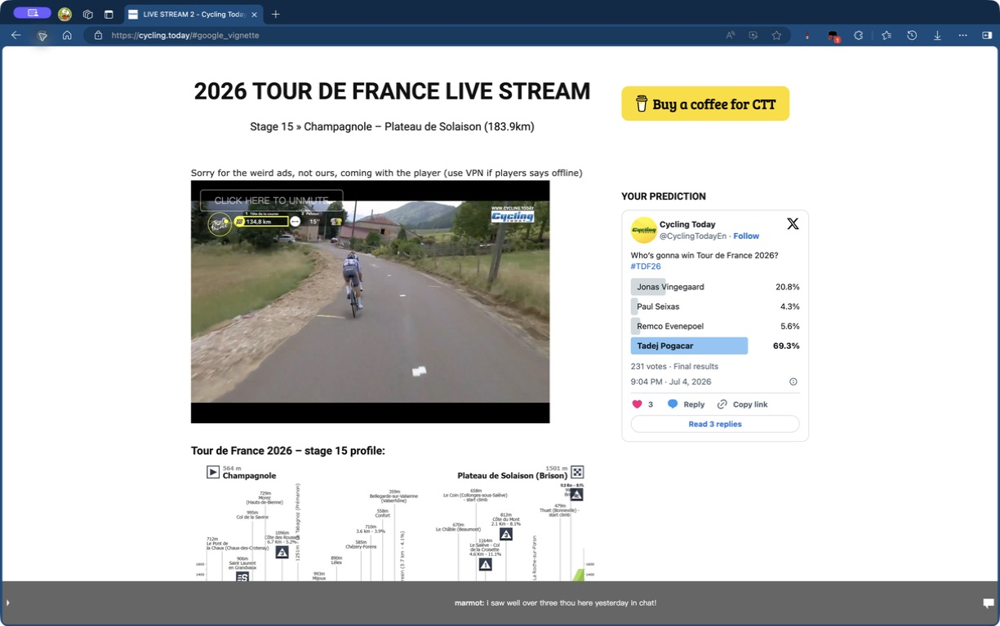

# Cycling Today Clean Mobile Player

一个面向 **Microsoft Edge + Tampermonkey** 的用户脚本，让 [cycling.today](https://cycling.today/) 更干净、更可靠。

A userscript for **Microsoft Edge + Tampermonkey** that makes [cycling.today](https://cycling.today/) cleaner and more reliable.

## 效果对比 / Before & After

<table>
  <tr>
    <th width="50%">使用前：广告与损坏的播放器 Before: ads and a broken player</th>
    <th width="50%">使用后：无广告且正常播放 After: clean page and working player</th>
  </tr>
  <tr>
    <td></td>
    <td></td>
  </tr>
</table>

## 功能 / Features

- 去除 Google 广告、广告 iframe、跟踪脚本、弹窗和延迟插入的广告。
- 使用 iPhone 移动 UA 获取播放器，避免桌面请求被 Cloudflare 403 拦截。
- 内联受阻的播放器资源，并代理 HLS 请求，保证嵌入播放器正常打开。
- Removes Google ads, ad iframes, trackers, pop-ups, and dynamically inserted ads.
- Fetches the player with an iPhone mobile UA to avoid Cloudflare 403 blocks on desktop requests.
- Inlines blocked player resources and proxies HLS requests so the embedded stream can load normally.

## 使用方法 / Installation

1. 在 Edge 中安装 [Tampermonkey](https://www.tampermonkey.net/)。  
   Install [Tampermonkey](https://www.tampermonkey.net/) in Edge.
2. 打开 [用户脚本原始文件](https://raw.githubusercontent.com/MDX-Tom/cycling-today-clean-mobile-player/main/cycling-today-clean-mobile-player.user.js)，然后点击安装。  
   Open the [raw userscript](https://raw.githubusercontent.com/MDX-Tom/cycling-today-clean-mobile-player/main/cycling-today-clean-mobile-player.user.js), then click **Install**.
3. 访问 [cycling.today](https://cycling.today/)。如果 Tampermonkey 询问视频 CDN 的跨域权限，选择“总是允许此域名”。  
   Visit [cycling.today](https://cycling.today/). If Tampermonkey asks for media-CDN access, choose **Always allow this domain**.

> 脚本不会提供或替代 VPN；它修复的是同一 VPN 节点下的桌面 UA、Cloudflare 403 和播放器资源问题。  
> This script does not provide or replace a VPN; it fixes desktop-UA, Cloudflare 403, and player-resource issues on an otherwise working connection.
